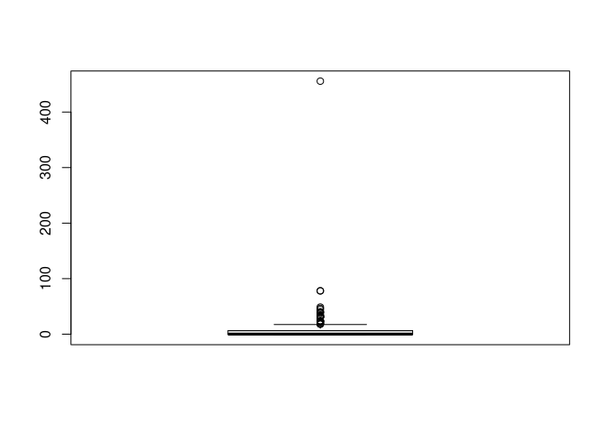
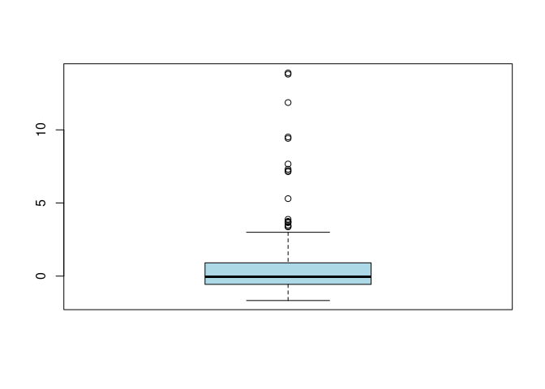

In this package, a robust estimation and variable selection procedure
for partially linear additive models is performed using the real dataset
from nutritional epidemiology.

Let’s first load the script.

``` r
source("R/rplam-vs-fn.R")
```

Let’s begin by reading the data.

``` r
datos <- read.table("Plasma_Retinol.txt", sep="\t")
str(datos)
```

    ## 'data.frame':    315 obs. of  14 variables:
    ##  $ V1 : int  64 76 38 40 72 40 65 58 35 55 ...
    ##  $ V2 : int  2 2 2 2 2 2 2 2 2 2 ...
    ##  $ V3 : int  2 1 2 2 1 2 1 1 1 2 ...
    ##  $ V4 : num  21.5 23.9 20 25.1 21 ...
    ##  $ V5 : int  1 1 2 3 1 3 2 1 3 3 ...
    ##  $ V6 : num  1299 1032 2372 2450 1952 ...
    ##  $ V7 : num  57 50.1 83.6 97.5 82.6 56 52 63.4 57.8 39.6 ...
    ##  $ V8 : num  6.3 15.8 19.1 26.5 16.2 9.6 28.7 10.9 20.3 15.5 ...
    ##  $ V9 : num  0 0 14.1 0.5 0 1.3 0 0 0.6 0 ...
    ##  $ V10: num  170.3 75.8 257.9 332.6 170.8 ...
    ##  $ V11: int  1945 2653 6321 1061 2863 1729 5371 823 2895 3307 ...
    ##  $ V12: int  890 451 660 864 1209 1439 802 2571 944 493 ...
    ##  $ V13: int  200 124 328 153 92 148 258 64 218 81 ...
    ##  $ V14: int  915 727 721 615 799 654 834 825 517 562 ...

Since a robust approach will be applied, we standarizing the continuos
covariates robustly.

``` r
age <- (datos$V1 - median(datos$V1))/mad(datos$V1)
sex <- datos$V2-1
smokstat <- datos$V3
smok1 <- as.numeric(datos$V3==2)
smok2 <- as.numeric(datos$V3==3)
quetelet <- (datos$V4 - median(datos$V4))/mad(datos$V4)
vituse <- datos$V5
vit1 <- as.numeric(datos$V5==1)
vit2 <- as.numeric(datos$V5==2)
calories <- (datos$V6 - median(datos$V6))/mad(datos$V6)
fat <- (datos$V7-median(datos$V7))/mad(datos$V7)
fiber <- (datos$V8-median(datos$V8))/mad(datos$V8)
alcohol <- (datos$V9-median(datos$V9))/mad(datos$V9)
cholesterol <- (datos$V10-median(datos$V10))/mad(datos$V10)
betadiet <- (datos$V11-median(datos$V11))/mad(datos$V11)
retdiet <- (datos$V12-median(datos$V12))/mad(datos$V12)
retplasma <- (datos$V14-median(datos$V14))/mad(datos$V14)
Z <- cbind(sex,smok1,smok2,quetelet,vit1,vit2,calories,
           fat,alcohol,betadiet)
X <- cbind(age,cholesterol,fiber)
```

And also the response variable.

``` r
betaplasma <- (datos$V13-median(datos$V13))/mad(datos$V13)
y <- betaplasma
```

It can be appreciated an extreme outlier in ‘alcohol’.


We will apply a robust estimator that simultaneoulsy select variables
from the linear and the additive parts of the model.

We consider two grids for the auxiliary parameters.

``` r
grid.la1 <- seq(0, 0.1, by=0.01)
grid.la2 <- seq(0, 2, by=0.1)
```

and compute the proposal using cubic splines. Take into account that the
computation of the estimator over these grid takes about 723 secs in an
Intel Core i7-10700 CPU @ 2.90GHz × 16.

``` r
degree.spline <- 3
system.time(
fit.rob <- plam.rob.vs(y, Z, X, degree.spline=degree.spline, grid.la1=grid.la1, grid.la2=grid.la2)
)
```

The results obtained are the following:

``` r
fit.rob$nknots
```

    ## [1] 0

``` r
fit.rob$coef.const
```

    ## (Intercept) 
    ##  -0.1547421

``` r
fit.rob$coef.lin
```

    ##  [1]  3.271272e-01 -3.487891e-04 -4.476918e-01 -1.443187e-01  1.760976e-02
    ##  [6]  4.014962e-04 -7.657490e-05 -2.553883e-09 -4.671541e-15  1.105704e-01

``` r
fit.rob$la1
```

    ## [1] 0.02

``` r
fit.rob$la2
```

    ## [1] 1.2

Are there covariables irrelevant for the model?

``` r
fit.rob$is.zero
```

    ##  [1] FALSE  TRUE FALSE FALSE FALSE  TRUE  TRUE  TRUE  TRUE FALSE  TRUE  TRUE
    ## [13]  TRUE

It can be appreciated that only five covariates are considered important
for the model for the robust approach.

Let’s see if the proposal identifies any large residuals:


17 observations were identified by the boxplot. These observations
corresponds to observations

``` r
in.ro <- (1:length(res))[ res %in% aa$out ]
in.ro
```

    ##  [1]  28  35  39  40 137 148 163 168 178 182 208 219 223 262 263 270 299
